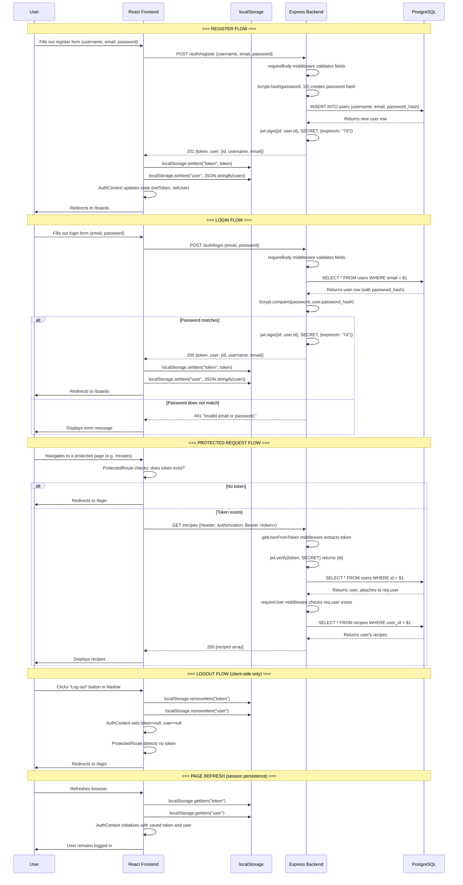

# Authentication Flow

## Overview

RecipeBox uses JWT (JSON Web Token) authentication. Passwords are hashed with bcrypt before storage. Tokens are stored in localStorage so users stay logged in across browser refreshes.

## Flow Diagram

## Key Files

| File | Role |
|------|------|
| `frontend/src/api/auth.js` | loginUser() and registerUser() — makes fetch calls to backend |
| `frontend/src/auth/AuthContext.jsx` | Stores token + user in React state and localStorage |
| `frontend/src/auth/ProtectedRoute.jsx` | Redirects to /login if no token exists |
| `backend/api/auth.js` | POST /auth/register and POST /auth/login route handlers |
| `backend/middleware/getUserFromToken.js` | Extracts JWT from Authorization header on every request |
| `backend/middleware/requireUser.js` | Blocks request with 401 if no user is attached |
| `backend/utils/jwt.js` | createToken() and verifyToken() wrappers around jsonwebtoken |
| `backend/db/queries/users.js` | createUser() with bcrypt hash, getUserByEmailAndPassword() with bcrypt compare |
